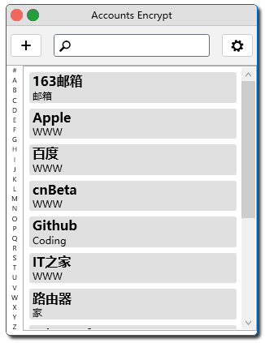

# Account EnCrypt
Account EnCrypt 是一个注重搜索的账户管理器，支持中文、英文、拼音首字母、全拼的搜索。
软件利用 [System.Data.SQLite][sqlite] 存储账户信息、[OpenSSL][openssl]
的加密库完成数据库文件加密。

[sqlite]: http://system.data.sqlite.org/index.html/doc/trunk/www/index.wiki
[openssl]: http://www.openssl.org/

## 系统需求

- Windows 7 或更新操作系统
- .Net Framework 4.5.2

## 使用方法

### 首次运行

首次运行软件，会在软件所在目录建立 `config.ini` 配置文件。

1. 点击主界面右上角的设置按钮，打开 *数据库* 界面，点击 *数据库* 右侧的 *选择文件按钮*，
保存数据库文件路径。

2. 输入一串字符串做为密钥。

3. 点击 *保存* 按钮。

4. 界面切换为登录界面。

### 添加账户

1. 点击主界面左上角 *+* 按钮，显示新建账户界面。

2. 输入账户的相关信息，并保存。

### 查看账户

查看账户的方法：

- 通过鼠标点击主界面左侧快速导航按钮，点击要查看的账户，进入账户详细信息。

- 在搜索框输入要查账户的名称或者拼音，在搜索结果页面点击账户，或者回车选择搜索结果第一
项，进入账户详细信息。

### 修改或删除账户

进入账户详细信息后，在界面上方可以选择 *修改* 或者 *删除* 账户。

*注意：修改账户信息不能修改标签。*

## 设置

点击主界面左上角 *设置* 按钮，显示设置界面。

可以修改密码、导出全部账户、修改界面语言、显示程序信息。

## 附加信息

外部库的版本：

- OpenSSL 1.0.2a

- SQLite sqlite-netFx451-binary-bundle-Win32-2013-1.0.97.0

## 协议

Account EnCrypt 在 [GPL v3][gpl] 下发布。

[gpl]: http://www.gnu.org/licenses/gpl.html
